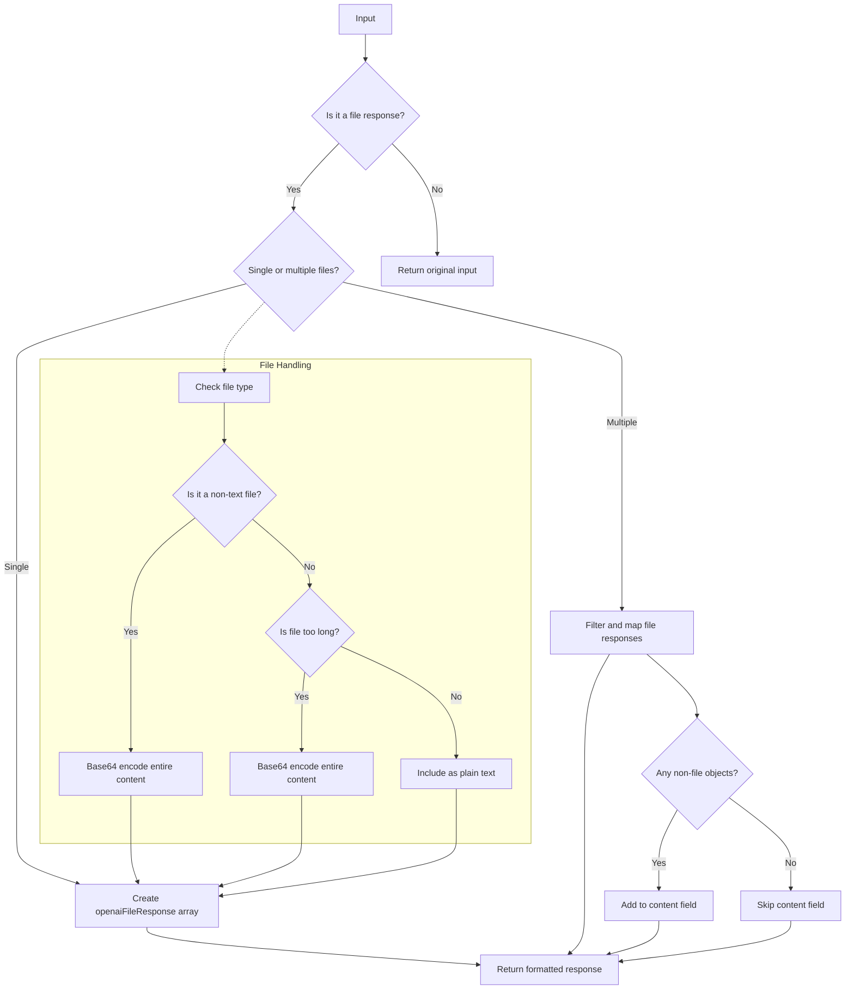

# Smart Actions FS

Smart Actions FS is a library that offers file system operations as smart actions. These actions can be integrated into projects to handle file and folder operations like in Smart Connect.

## Features

- Read File: Retrieve file contents from a path.
- List Files: Get a list of files in a folder.
- Create File: Create a file with content at a path.
- List Folders: Get a list of folders in a directory.

Smart Actions FS is designed to work seamlessly with Smart Connect, providing essential file system operations. These actions can be used to enhance the functionality of Smart Connect, allowing for more advanced file management and data retrieval capabilities.

## Customization

Smart Actions FS can be extended with custom actions. Developers can create their own file system related actions to suit specific project needs.

## Explanation of format_openai_file_response

The `format_openai_file_response` function standardizes responses from OpenAI's file-related API calls, efficiently handling large file outputs as an alternative to truncation:

1. **Base64 Encoding**: Used for binary files, allowing representation as text in JSON responses.
2. **Separate Structure**: Creates `openaiFileResponse` array for file-related objects.
3. **Mime Type Identification**: Identifies file responses using `mime_type` property.
4. **Full Content Preservation**: Encodes entire content in base64 for large files, avoiding truncation.
5. **Consistent Structure**: Maintains uniform response structure for all file types and sizes.

### Handling Large Files

- Binary files (e.g., PDFs) and large text files are base64 encoded.
- Entire content is preserved in the `content` field of the response.
- Client-side decoding and processing allow flexible handling of large files.

### Mermaid Chart: format_openai_file_response Usage Flow

